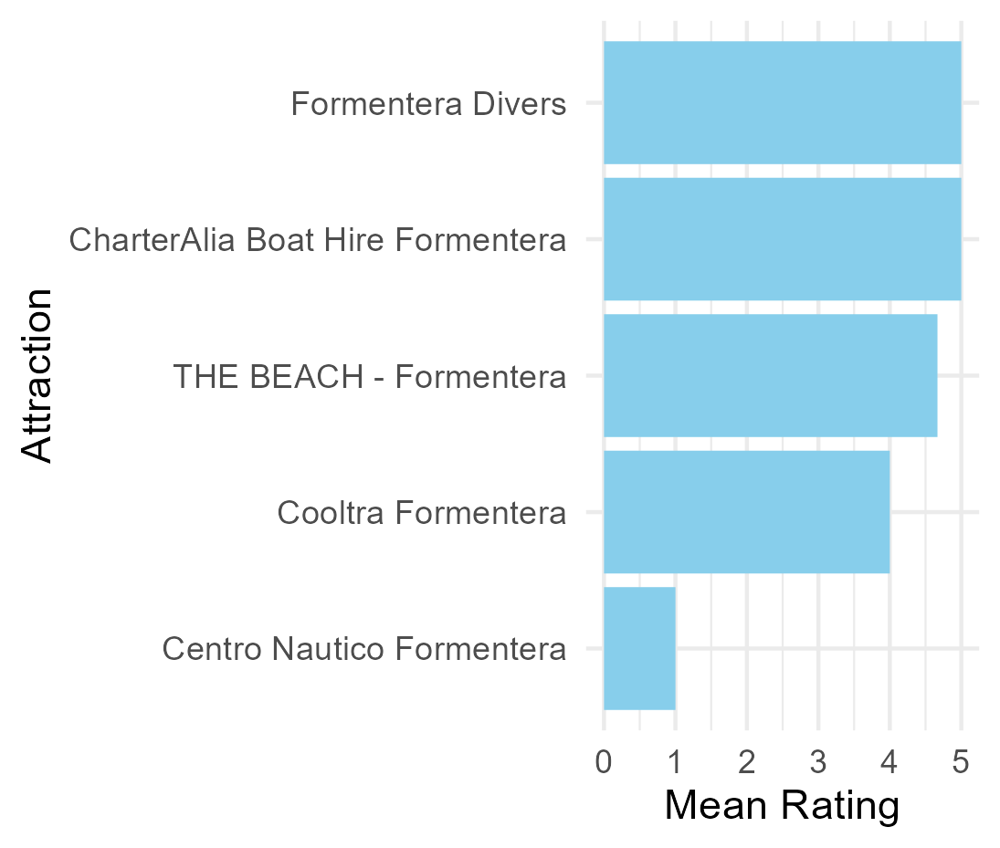

```{r setup, include=FALSE}
knitr::opts_chunk$set(echo = TRUE)
```

# The best attractions for couples to visit in Formentera

## Introduction
Formentera is a beautiful island in the Mediterranean Sea. It is the smallest of the Balearic Islands and is located just south of Ibiza. Formentera is known for its stunning beaches, crystal-clear waters, and laid-back atmosphere. It is the perfect destination for couples looking for a romantic getaway. For my final capstone project of the data mining course at the University of Lucerne, I will highlight some of the best attractions for couples to visit in Formentera. Further more I will create a shiny app that will help travellers to plan their next trip to Formentera. The app will show the must see places for each travel type based on the ratings of their fellow travellers.

## Data Collection
I collected data on the top attractions in Formentera from TripAdvisor. I used the Tripadvisor API to extract information on the attractions, including their names, locations, ratings, and reviews. Unfortunately, the API only allowed me to extract data of 10 attractions with the search query "formentera". Of those 10 attractions, two were not in Formentera, so I only have data on 8 attractions. The same problem occured when I extracted the data on the reviews for each attraction. The API gave me a maximum of 10 reviews per attraction. The documentation gave no information about a limitation of results or on how to get more than 10 results per request. So I was looking for solutions on the internet and found a stackoverflow and a google groups post where someone had the same problem in 2019. But there was no solution to the problem. So I decided to use the data I have and to work with it.

## Results
I analyzed the data on the top attractions in Formentera to identify the best attractions for couples to visit. I looked at the ratings and reviews of each attraction to determine which ones are the best and most rated from couples. I looked at the top 5 attractions rated by couples and the top 5 attractions most rated by couples to determine which ones are the best to visit.
```{r incluse-image-best-rated-by-couples, echo=FALSE}
#Load packages
library(knitr)

#Show the visualization of the best attractions rated by couples

```

```{r incluse-image-most-rated-by-couples, echo=FALSE}
#Show the visualization of the attractions most rated by couples

```

According to these two plots the best attraction for couples to visit in Formentera is "Formentera Divers". It has the highest rating and the most ratings from couples of all other attractions. But to determine if it is the best attraction only for couples or also for different travel groups I also looked at the ratings of other types of travelling groups. 
"Formentera Divers" has ratings from only two types of travelling groups: couples and families. Families also rated the attraction 5 stars. But there were only two ratings from families. So this attraction is the most popular with couples.

## Shiny App
I tried to create a shiny app that will help travellers to plan their next trip to Formentera. The app will show the must see places for each travel type based on the ratings of their fellow travellers. The app is not finished yet. I have some problems with the interactive feature of the app.

## Conclusion
In conclusion, "Formentera Divers" is the best attraction for couples to visit in Formentera. It has the highest rating and the most ratings from couples of all other attractions.
However, it is important to note that the data I collected is limited to only 8 attractions and a maximum of 10 reviews per attraction. So the results are not representative of all the attractions in Formentera. Further research is needed to determine the best attractions for couples to visit in Formentera. One possibility would be to change the platform to collect the data. For example to use Google Places API. 
What I learned in this project is that it is important to check the possibilities of an API thoroughly before starting to collect the data. I also learned that it is important to have a plan B in case the API does not provide the data you need. 
I also went the first steps in learning about how to create a shiny app. I have never worked with shiny before and I learned a lot about it. I will continue to work on the app and try to solve the problems I have with the interactive feature.